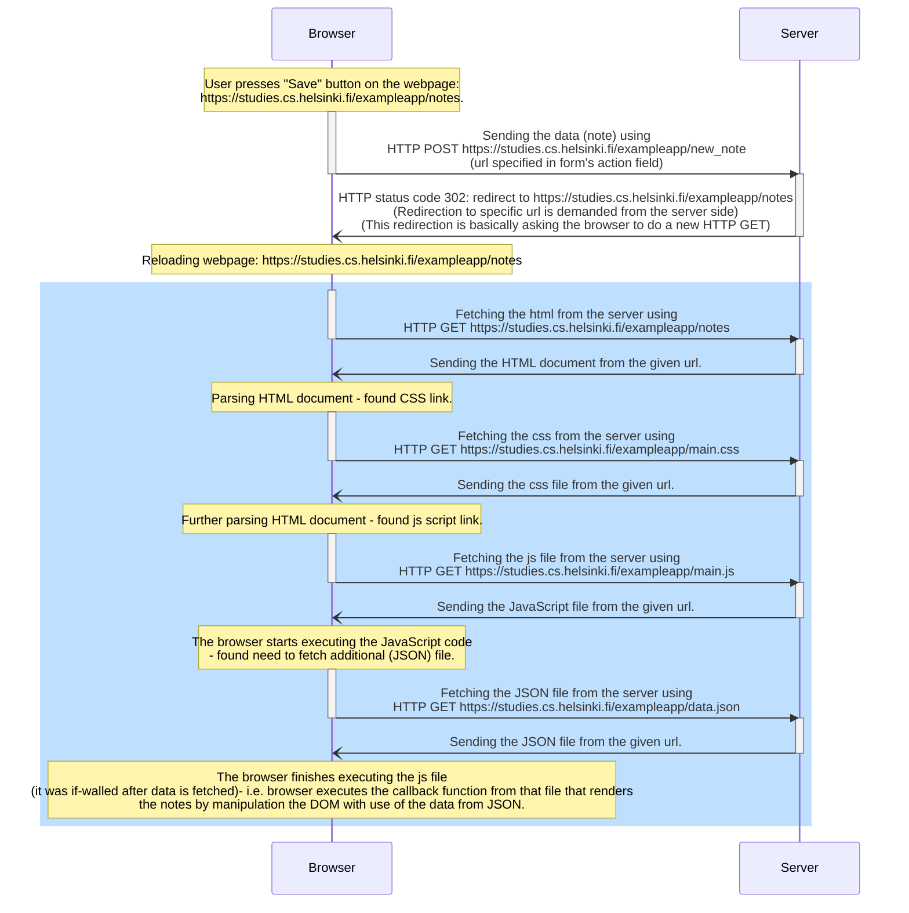

```mermaid


sequenceDiagram
    participant b as Browser
    participant s as Server
    
        Note over b: User presses "Save" button on the webpage:<br/>https://studies.cs.helsinki.fi/exampleapp/notes.
    

    activate b
        b->>s: Sending the data (note) using <br/> HTTP POST https://studies.cs.helsinki.fi/exampleapp/new_note <br/> (url specified in form's action field) 
    deactivate b
    activate s
        s-)b: HTTP status code 302: redirect to https://studies.cs.helsinki.fi/exampleapp/notes <br/> (Redirection to specific url is demanded from the server side) <br/> (This redirection is basically asking the browser to do a new HTTP GET)
    deactivate s

        Note over b: Reloading webpage: https://studies.cs.helsinki.fi/exampleapp/notes
    
    rect rgb(191, 223, 255)    

        activate b
            b->>s: Fetching the html from the server using <br/> HTTP GET https://studies.cs.helsinki.fi/exampleapp/notes
        deactivate b
        activate s
            s-)b: Sending the HTML document from the given url.
        deactivate s

            Note over b: Parsing HTML document - found CSS link.

        activate b
            b->>s: Fetching the css from the server using <br/> HTTP GET https://studies.cs.helsinki.fi/exampleapp/main.css
        deactivate b
        activate s
            s-)b: Sending the css file from the given url.
        deactivate s

            Note over b: Further parsing HTML document - found js script link.
        
        activate b
            b->>s: Fetching the js file from the server using <br/> HTTP GET https://studies.cs.helsinki.fi/exampleapp/main.js
        deactivate b
        activate s
            s-)b: Sending the JavaScript file from the given url.
        deactivate s

            Note over b: The browser starts executing the JavaScript code <br/>- found need to fetch additional (JSON) file.
        
        activate b
            b->>s:Fetching the JSON file from the server using <br/> HTTP GET https://studies.cs.helsinki.fi/exampleapp/data.json
        deactivate b
        activate s
            s-)b: Sending the JSON file from the given url.
        deactivate s

            Note over b: The browser finishes executing the js file <br/> (it was if-walled after data is fetched)- i.e. browser executes the callback function from that file that renders <br/> the notes by manipulation the DOM with use of the data from JSON.
    end
    
```