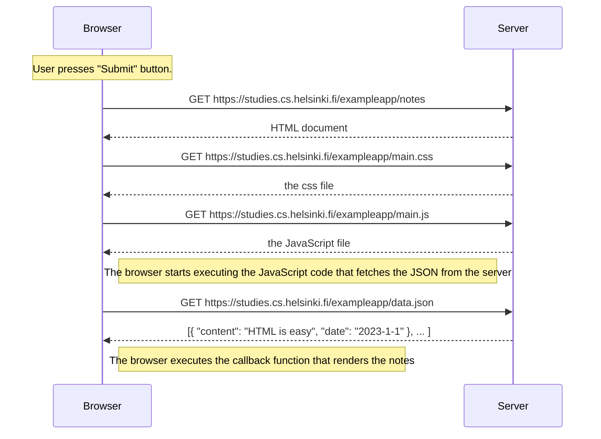

```mermaid
sequenceDiagram
    participant b as Browser
    participant s as Server
    
    Note over b: User presses "Submit" button.

    b->>s: GET https://studies.cs.helsinki.fi/exampleapp/notes
    s-->>b: HTML document
    
    b->>s: GET https://studies.cs.helsinki.fi/exampleapp/main.css
    s-->>b: the css file
    
    b->>s: GET https://studies.cs.helsinki.fi/exampleapp/main.js
    s-->>b: the JavaScript file
    
    Note right of b: The browser starts executing the JavaScript code that fetches the JSON from the server
    
    b->>s: GET https://studies.cs.helsinki.fi/exampleapp/data.json
    s-->>b: [{ "content": "HTML is easy", "date": "2023-1-1" }, ... ]

    Note right of b: The browser executes the callback function that renders the notes
    
```