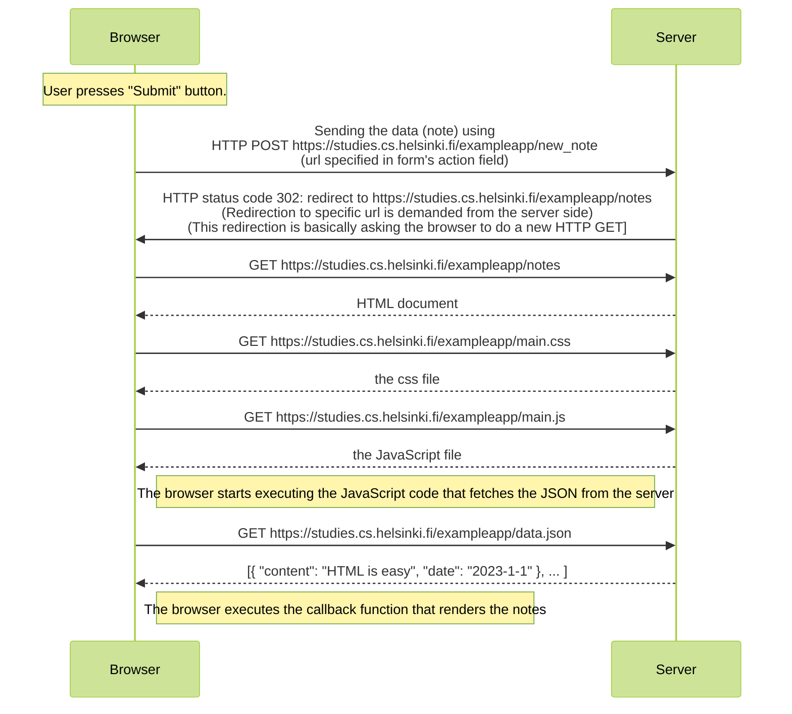

```mermaid
%%{init: {'theme':'forest'}}%%

sequenceDiagram
    participant b as Browser
    participant s as Server
    
    Note over b: User presses "Submit" button.
    
    b->>s: Sending the data (note) using <br/> HTTP POST https://studies.cs.helsinki.fi/exampleapp/new_note <br/> (url specified in form's action field) 
    s->>b: HTTP status code 302: redirect to https://studies.cs.helsinki.fi/exampleapp/notes <br/> (Redirection to specific url is demanded from the server side) <br/> (This redirection is basically asking the browser to do a new HTTP GET]

    b->>s: GET https://studies.cs.helsinki.fi/exampleapp/notes
    s-->>b: HTML document
    
    b->>s: GET https://studies.cs.helsinki.fi/exampleapp/main.css
    s-->>b: the css file
    
    b->>s: GET https://studies.cs.helsinki.fi/exampleapp/main.js
    s-->>b: the JavaScript file
    
    Note right of b: The browser starts executing the JavaScript code that fetches the JSON from the server
    
    b->>s: GET https://studies.cs.helsinki.fi/exampleapp/data.json
    s-->>b: [{ "content": "HTML is easy", "date": "2023-1-1" }, ... ]

    Note right of b: The browser executes the callback function that renders the notes
    
```