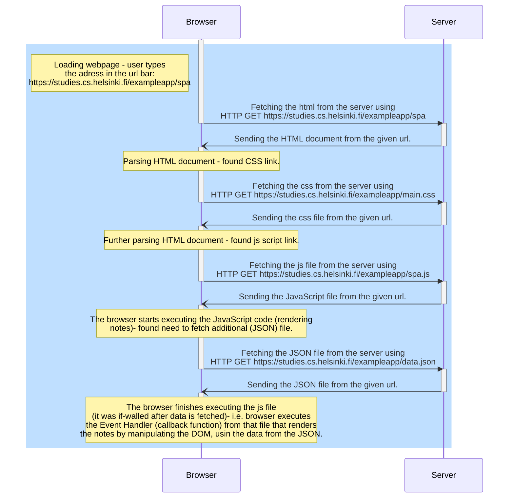

```mermaid


sequenceDiagram
    participant b as Browser
    participant s as Server

    activate b
        rect rgb(191, 223, 255)
        Note left of b: Loading webpage - user types <br/> the adress in the url bar: <br/> https://studies.cs.helsinki.fi/exampleapp/spa    
        b->>s: Fetching the html from the server using <br/> HTTP GET https://studies.cs.helsinki.fi/exampleapp/spa
    deactivate b
    activate s
        s-)b: Sending the HTML document from the given url.
    deactivate s
    activate b
        Note over b: Parsing HTML document - found CSS link.
        b->>s: Fetching the css from the server using <br/> HTTP GET https://studies.cs.helsinki.fi/exampleapp/main.css
    deactivate b
    activate s
        s-)b: Sending the css file from the given url.
    deactivate s
    activate b
        Note over b: Further parsing HTML document - found js script link.        
        b->>s: Fetching the js file from the server using <br/> HTTP GET https://studies.cs.helsinki.fi/exampleapp/spa.js
    deactivate b
    activate s
        s-)b: Sending the JavaScript file from the given url.
    deactivate s
    activate b
        Note over b: The browser starts executing the JavaScript code (rendering <br/> notes)- found need to fetch additional (JSON) file.
        b->>s:Fetching the JSON file from the server using <br/> HTTP GET https://studies.cs.helsinki.fi/exampleapp/data.json
    deactivate b
    activate s
        s-)b: Sending the JSON file from the given url.
    deactivate s
    activate b
        Note over b: The browser finishes executing the js file <br/> (it was if-walled after data is fetched)- i.e. browser executes<br/> the Event Handler (callback function) from that file that renders <br/> the notes by manipulating the DOM, usin the data from the  JSON.
    deactivate b
end
    
```