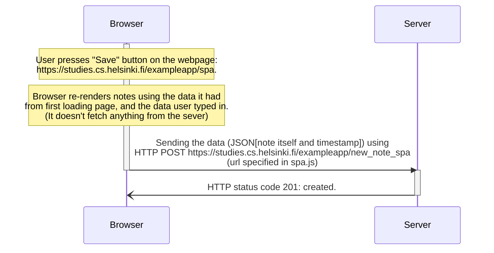

```mermaid


sequenceDiagram
    participant b as Browser
    participant s as Server
    
    activate b
        Note over b: User presses "Save" button on the webpage:<br/>https://studies.cs.helsinki.fi/exampleapp/spa.
        Note over b: Browser re-renders notes using the data it had <br/> from first loading page, and the data user typed in. <br/> (It doesn't fetch anything from the sever)

        b->>s: Sending the data (JSON[note itself and timestamp]) using <br/> HTTP POST https://studies.cs.helsinki.fi/exampleapp/new_note_spa <br/> (url specified in spa.js) 
    deactivate b

    activate s
        s-)b: HTTP status code 201: created.
    deactivate s  

    
```